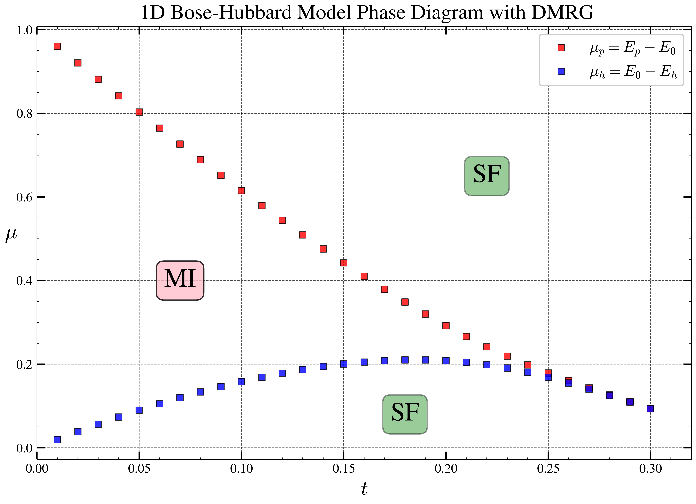

# 1D Bose-Hubbard Model DMRG (vMPS) Phase Diagram Calculation 



This project uses the two-site density matrix renormalization group (DMRG) / variational matrix product state (vMPS) algorithm combined with finite-size scaling to compute with high precision the Mott insulator phase boundaries of the one-dimensional Bose-Hubbard model at unit filling, reproducing the famous cusp-shaped Mott lobes.
---

## Background

The one-dimensional Bose-Hubbard model describes interacting bosons in an optical lattice, with Hamiltonian

$$
H = -t \sum_{\langle i,j\rangle} (a_i^\dagger a_j + \mathrm{h.c.}) + \frac{U}{2} \sum_i n_i(n_i-1),
$$

where $t$ is the hopping strength and $U$ the on-site interaction. This code uses $U=1$ as the energy unit and $t$ as the tunable parameter. Near uniform filling $n=1$, the system exhibits a Mott insulating phase whose phase boundary in the thermodynamic limit has a cusp-like shape, going beyond the qualitative parabola of mean-field theory. Mean-field self-consistent iteration only gives a qualitative Mott lobe and fails to capture the famous cusp shape and phase boundary in one dimension.

Following the method of the original paper *The one-dimensional Bose-Hubbard Model with nearest-neighbor interaction*, this project extracts the chemical potentials $\mu_p(t)$ and $\mu_h(t)$ in the thermodynamic limit via finite-size scaling of particle and hole excitation energies, thereby producing a high-precision Mott lobe.

Core problems solved by this code:  
1. Construct the Bose-Hubbard Hamiltonian MPO with a particle-number penalty term, ensuring particle number conservation for specified excited states.  
2. Implement a complete two-site vMPS (DMRG) algorithm, including environment contraction, coarse-graining, Lanczos diagonalization, SVD truncation, and bidirectional sweeps.  
3. Parallel scan over parameter space $(t, L, \mathrm{excite})$, compute ground-state energies for different system sizes, and obtain finite-size chemical potentials.  
4. For each $t$, perform linear extrapolation of $\mu$ vs. $1/L$ to obtain thermodynamic limit results and plot the phase boundary.

---

## Method / Algorithm (matching code order)

### 1. MPO Construction and Particle Number Constraint

The Hamiltonian of the 1D Bose‑Hubbard model can be written as

$$
H_{\mathrm{BH}} = -t \sum_{\langle i,j\rangle} (a_i^\dagger a_j + \mathrm{h.c.}) + \frac{U}{2} \sum_i n_i(n_i-1)
$$

Take $U=1$ as the energy unit. When representing this Hamiltonian as an MPO, the local tensor on each site is a $4\times4$ matrix whose entries are $d\times d$ operators:

$$
W_{\mathrm{BH}}(t) =
\begin{pmatrix}
I & a^\dagger & -t a & \frac{1}{2}n(n-1) \\
0 & 0 & 0 & -t a \\
0 & 0 & 0 & a^\dagger \\
0 & 0 & 0 & I
\end{pmatrix}
$$

Here $I$ is the $d$-dimensional identity matrix, $a$ and $a^\dagger$ are bosonic annihilation and creation operators (truncated at $n_{\max}=4$), and $n$ is the number diagonal matrix $\mathrm{diag}(0,1,\dots,n_{\max})$. The left boundary tensor is taken as the first row of the above matrix, and the right boundary tensor as the last column.

To obtain the ground state in a specified particle-number sector, we add a penalty term $\lambda(\hat{N}-N_{\mathrm{target}})^2$ to the Hamiltonian, where $\hat{N}=\sum_i n_i$ is the total particle number operator, $N_{\mathrm{target}}=L+\mathrm{excite}$ is the target particle number, and $\lambda=10$ is the penalty strength. Expanding the penalty term:

$$
\lambda(\hat{N}-N_{\mathrm{target}})^2 = \lambda\hat{N}^2 - 2\lambda N_{\mathrm{target}}\hat{N} + \lambda N_{\mathrm{target}}^2
$$

Construct the MPO for each part separately and then combine them via direct sum.

- **The $\lambda\hat{N}^2$ term**: its MPO local tensor is a $3\times3$ block matrix

$$
W_{\lambda N^2} =
\begin{pmatrix}
I & \sqrt{\lambda}n & \lambda n^2 \\
0 & I & 2\sqrt{\lambda}n \\
0 & 0 & I
\end{pmatrix}
$$

This construction ensures that the product expands exactly to $\lambda(\sum_i n_i)^2$.

- **The $-2\lambda N_{\mathrm{target}}\hat{N}$ term**: first write the MPO tensor for $\hat{N}$, which is $2\times2$:

$$
W_N =
\begin{pmatrix}
I & n \\
0 & I
\end{pmatrix}
$$

Hence the local tensor for this term becomes

$$
W_{cN} =
\begin{pmatrix}
I & -2\lambda N_{\mathrm{target}} n \\
0 & I
\end{pmatrix}
$$

- **Constant term $\lambda N_{\mathrm{target}}^2$**: corresponds to an identity MPO with auxiliary dimension 1, i.e., local tensor $W_c = \lambda N_{\mathrm{target}}^2 I$ (as a $1\times1$ matrix).

To combine them into the total penalty MPO, we use **MPO addition (direct sum)**. For two middle-site tensors $W_A$ (shape $(a,b,d,d)$ ) and $W_B$ (shape $(c,e,d,d)$ ), their sum is a block-diagonal tensor of shape $(a+c, b+e, d,d)$:

$$
(W_A \oplus W_B)_{\alpha\beta} =
\begin{cases}
(W_A)_{\alpha\beta}, & \alpha<a,\;\beta<b\\
(W_B)_{(\alpha-a)(\beta-b)}, & \alpha\ge a,\;\beta\ge b\\
0, & \text{otherwise}
\end{cases}
$$

For left and right boundary tensors, the addition must keep the external auxiliary dimension equal to 1. Specifically, left boundary tensors of shapes $(1, r_A)$ and $(1, r_B)$ sum to shape $(1, r_A+r_B)$; right boundary tensors of shapes $(l_A, 1)$ and $(l_B, 1)$ sum to shape $(l_A+l_B, 1)$.

Following this rule, first add the $-2\lambda N_{\mathrm{target}}\hat{N}$ term (dimension 2) and the constant term (dimension 1) to obtain an MPO with auxiliary dimension $2+1=3$; then add this to the $\lambda\hat{N}^2$ term (dimension 3) to obtain the total penalty MPO with auxiliary dimension $3+3=6$. Finally, add the Bose‑Hubbard MPO (dimension 4) and the total penalty MPO to get the **total Hamiltonian MPO**, which has auxiliary dimension $4+6=10$ and corresponds to the operator

$$
H_{\mathrm{tot}} = H_{\mathrm{BH}} + \lambda(\hat{N}-N_{\mathrm{target}})^2\; .
$$

A sufficiently large $\lambda$ guarantees that after DMRG optimization the total particle number is precisely locked to $N_{\mathrm{target}}$.

---

### 2. MPS Initialization and Excited States

A matrix product state (MPS) represents a many-body wavefunction as a set of third-order tensors $A^{s_i} _ {\alpha_i\alpha_{i+1}}$ on each site, where $s_i\in\{0,1,\dots,n_{\max}\}$ is the physical index and $\alpha_i$ are auxiliary indices (bond dimensions, initially 1). We start from a product state corresponding to the target filling and converge to the true eigenstate via DMRG iterations.

- **Ground state ($\mathrm{excite}=0$)**: each site has exactly one particle. The corresponding MPS tensor has shape $(d,1,1)$, and only the component with $s=1$ is 1:

$$
A^{s} = \delta_{s,1} \quad\Rightarrow\quad A^{1}_{0,0}=1,\; A^{s\neq 1}_{0,0}=0
$$

This is the product state $|\psi_0\rangle = |1\rangle^{\otimes L}$.

- **Particle excitation ($\mathrm{excite}=+1$)**: total particle number $N_{\mathrm{target}} = L+1$. Place an extra particle at the central site $i = \lfloor L/2 \rfloor$, making its occupation 2 while all other sites remain 1. The central site tensor is

$$
A^{s} = \delta_{s,2} \quad\Rightarrow\quad A^{2}_{0,0}=1
$$

All other sites are the same as the ground state. This state corresponds to an additional particle excitation.

- **Hole excitation ($\mathrm{excite}=-1$)**: total particle number $N_{\mathrm{target}} = L-1$. Set the central site occupation to 0:

$$
A^{s} = \delta_{s,0} \quad\Rightarrow\quad A^{0}_{0,0}=1
$$

Other sites remain $|1\rangle$, representing a hole excitation.

All these initial MPS have bond dimension 1. During subsequent two-site DMRG optimization, the bond dimension grows dynamically according to the truncation tolerance `target_trunc=1e-8` and an upper bound $D=625$, capturing quantum fluctuations and entanglement. Because the Hamiltonian includes the particle-number penalty term, even starting from product states, DMRG is guided toward the ground state with the correct particle number, ensuring consistency across the three excitation sectors.

---

### 3. Two‑Site DMRG (vMPS) Procedure (see Schollwöck’s famous review for a more detailed introduction)

Modern DMRG can be understood as a tensor network algorithm: the many-body Hamiltonian and state are decomposed into small tensors local to each site (called MPO and MPS respectively), and expectation values are computed via tensor contractions (which look like networks). Solving for the global ground state then reduces to sequentially visiting each site’s MPS tensor, contracting its surrounding “environment” (i.e., all MPO and MPS tensors except itself) to form an effective Hamiltonian, and finding the smallest eigenvector as the optimized tensor for that site.

The two‑site algorithm allows dynamic adjustment of the bond dimension between neighboring MPS tensors. At each step it merges two adjacent sites into a larger tensor, optimizes it, then performs an SVD decomposition and discards parts with small singular values. This reduces the number of tensors to be summed over. This step is directly related to quantum entanglement – the discarded parts are entanglement degrees of freedom that contribute negligibly to the current state. The specific procedure includes:

- **Environment tensors**: Starting from the vacuum on the boundaries, sequentially contract MPS and MPO to build left and right environments, which are later used to quickly construct effective Hamiltonians.
- **Coarse‑graining**: Merge the MPS of two adjacent sites into a two‑site tensor, and merge the corresponding MPO tensors into a two‑site effective MPO.
- **Effective Hamiltonian diagonalization**: Construct a `LinearOperator` that implements multiplication of the two‑site effective Hamiltonian on a wavefunction, and use `scipy.sparse.linalg.eigsh` (Lanczos) to solve for the smallest eigenvalue and corresponding eigenstate, giving the best approximate ground state for the current iteration.
- **Fine‑graining and truncation**: Perform SVD on the two‑site wavefunction, and adaptively truncate based on the cumulative sum of squared singular values, the truncation tolerance `target_trunc=1e-8`, and the maximum retained bond dimension `D=625`. Distribute the singular values to the left or right tensor according to the sweep direction, maintaining the MPS canonical form.
- **Bidirectional sweeps and environment update**: Alternately optimize all adjacent site pairs from left to right and from right to left, updating the corresponding environment tensors after each optimization. Repeat sweeps until the change in ground-state energy is less than `energy_tol=1e-7` or the maximum number of sweeps is reached.

---

### 4. Chemical Potentials and Finite‑Size Extrapolation

The code actually scans the parameters $t = 0.01,0.02,\dots,0.30$ (step 0.01), $L=32,64,128$, and $\mathrm{excite}=0,+1,-1$. For each $(t, L)$, compute the ground-state energies for the three excitation sectors:

- For each $(t, L)$, compute the ground-state energies of the three excited states, obtaining the finite-size chemical potentials $\mu_p(L)=E(L+1)-E(L)$ and $\mu_h(L)=E(L)-E(L-1)$.
- For fixed $t$, perform a linear fit of $\mu_p(L)$ and $\mu_h(L)$ vs. $1/L$, extrapolate to the thermodynamic limit ($1/L \to 0 \Leftrightarrow L\to\infty$); the intercepts give $\mu_p(t)$ and $\mu_h(t)$.
- All parameter combinations are computed in parallel using `multiprocessing.Pool`, greatly reducing runtime. Intermediate results are saved as `pickle` files to support resuming interrupted calculations.

### 5. Main Tunable Parameters

| Parameter | Value | Description |
|-----------|-------|-------------|
| Maximum bond dimension $D$ | 625 | Upper bound on number of retained states after truncation |
| Local maximum occupation $n_{\max}$ | 4 | Local Hilbert space truncation |
| Penalty coefficient $\lambda$ | 10 | Strength of particle number constraint |
| Energy convergence tolerance | $10^{-7}$ | DMRG sweep stopping criterion |
| SVD truncation target | $10^{-8}$ | Threshold for cumulative singular value discard |

---

## Code Structure

- `DMRG_BH_ycr.py` : Main program script, containing
  - MPO generation (Bose-Hubbard, particle number penalty, addition)
  - MPS initialization functions
  - Core two‑site DMRG algorithm (environment contraction, coarse‑graining, Lanczos diagonalization, SVD truncation, sweeps)
  - Chemical potential calculation and finite‑size extrapolation
  - Multi‑process parallel scheduling and main function `main()`
- `energy_results_lobe1&2/KT.pkl` : Dictionary of ground-state energies saved during computation (automatically generated)
- `DMRG_BH_ycr_Plot.py` : Produces publication‑quality figures
- `figure_result.png` : Output Mott lobe phase diagram (high resolution)
- `tensor_basic_Note.ipynb` : Practice notebook demonstrating tensor contraction, reshaping, etc. using numpy – essential operations for tensor network algorithms

---

## Dependencies

Running the code requires the following Python libraries:

- `numpy`
- `scipy`
- `matplotlib`
- `multiprocessing` (built-in)
- `pickle` (built-in)
- `time` (built-in)

Python 3.7 or higher is recommended.

---

## Quick Start

1. **Clone the repository** (or download the files):
   ```bash
   git clone https://github.com/chaoranyang/QuantumManyBody_FromZero.git
   cd QuantumManyBody_FromZero/BH_DMRG

2. **Install dependencies:**
   ```bash
   pip install numpy matplotlib SciencePlots

---

## Output

- **Console output**: For each $(t,L,\mathrm{excite})$ combination, displays the initial particle number, number of sweeps, ground-state energy, final particle number, and the expectation value of the true Hamiltonian, along with total runtime statistics.
- **Phase diagram figure**: `figure_result.png` shows $\mu_p(t)$ (particle excitation) and $\mu_h(t)$ (hole excitation) as functions of the hopping strength $t$. The two boundary curves enclose a sharp Mott lobe, consistent with numerical results in the literature, successfully capturing the cusp shape that mean‑field theory cannot reproduce.

---

## References

- Till D. Kühner, Steven R. White, and H. Monien. One-dimensional Bose-Hubbard model with nearest-neighbor interaction. *Phys. Rev. B*, 61:12474–12489, May 2000.
- Ulrich Schollwöck. The density-matrix renormalization group in the age of matrix product states. *Annals of Physics*, 326(1):96–192, January 2011.
