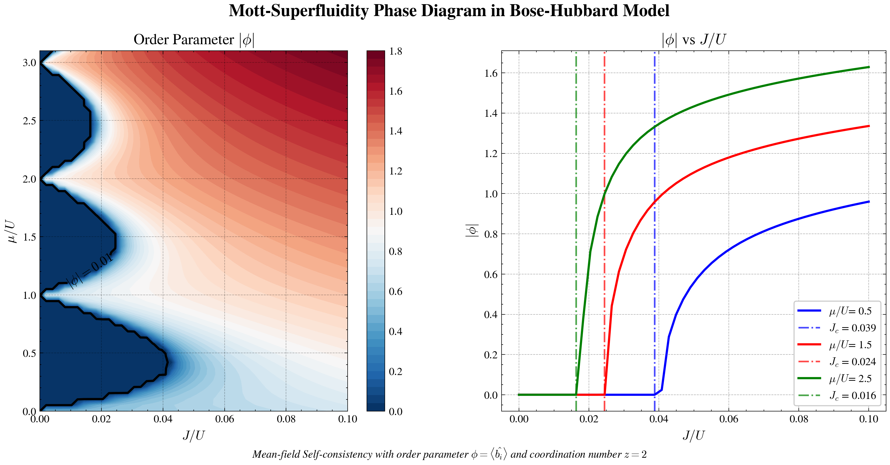

# Bose-Hubbard 模型平均场自洽算法绘制定性相图


本项目通过平均场自洽迭代求解 Bose-Hubbard 模型的超流序参量，遍历跳跃能 $J$ 与化学势 $\mu$ 的参数空间，基于序参量阈值绘制 Mott 绝缘体–超流相图，并分析固定化学势下的相变行为。

---

## 物理背景

Bose-Hubbard 模型描述光晶格中冷玻色子的动力学，其哈密顿量为

$$
H = -J \sum_{\langle i,j \rangle} \hat{b}_i^\dagger \hat{b}_j + \frac{U}{2} \sum_i \hat{n}_i (\hat{n}_i - 1) - \mu \sum_i \hat{n}_i,
$$

其中 $J$ 为最近邻跳跃能， $U$ 为格点在位排斥， $\mu$ 为化学势， $\hat{b}_i$ ( $\hat{b}_i^\dagger$ ) 为玻色子湮灭（产生）算符， $\hat{n}_i = \hat{b}_i^\dagger \hat{b}_i$ 为粒子数算符。

在平均场近似下，令 $\hat{b}_i = \phi + \delta \hat{b}_i$ 并忽略涨落的二阶项，多体问题退化为单格点有效哈密顿量：

$$
H_{\text{MF}} = -z J (\phi^* \hat{b} + \phi \hat{b}^\dagger) + z J |\phi|^2 + \frac{U}{2} \hat{n}(\hat{n}-1) - \mu \hat{n},
$$

其中 $z$ 为晶格配位数， $\phi = \langle \hat{b} \rangle$ 为超流序参量。自洽闭合条件为 $\phi$ 由该哈密顿量的基态期望值给出：

$$
\phi = \langle \psi_0(\phi) | \hat{b} | \psi_0(\phi) \rangle.
$$

本代码解决的核心问题：
1. 在截断的 Fock 空间中构造矩阵 $H_{\text{MF}}$ ，自洽迭代求解 $\phi$ ；
2. 遍历 $(J/U,\mu/U)$ 参数平面，计算每个点的 $|\phi|$ ，并以 $|\phi| > 0.01$ 作为超流相判据，绘制定性相图。

---

## 数值方法

### 1. 基矢与矩阵构建
- 取 $N_{\max}=50$ ，在粒子数基 $\{|n\rangle \} _ {n=0} ^ {N_{max} }$ 下构造维度为 $N_{\max}+1$ 的哈密顿矩阵。
- 对角线元素： $\frac{U}{2} n(n-1) - \mu n - 2 z J |\phi|^2$ ；
- 非对角元素： $H_{n,n+1} = -2 z J \phi^* \sqrt{n+1}$ ， $H_{n+1,n} = -2 z J \phi \sqrt{n+1}$ 。

### 2. 自洽迭代
- 给定初始猜测 $\phi_{\text{ini}} = 0.1 + 0.1\mathrm{i}$ 。
- 循环：用当前 $\phi_{\text{old}}$ 构建 $H$ → 对角化取基态波函数 $\psi$ → 计算新序参量 $\phi_{\text{new}} = \langle \psi | \hat{b} | \psi \rangle$ 。
- 更新采用线性混合： $\phi_{\text{old}} \leftarrow 0.7\phi_{\text{old}} + 0.3\phi_{\text{new}}$ ，以增强收敛稳定性。
- 收敛判据： $|\phi_{\text{new}} - \phi_{\text{old}}| < 10^{-6}$ ，或达到最大迭代次数 2000 时终止。

### 3. 参数扫描与相边界
- 在 $\mu/U \in [0, 3.1]$ (60 个点) 和 $J/U \in [0, 0.1]$ (50 个点) 的网格上逐点执行自洽迭代。
- 记录每个点的 $|\phi|$ ，并绘制等高线图；以 $|\phi| = 0.01$ 的等值线作为 Mott 绝缘体与超流相的定性边界。
- 另选三个固定化学势 $\mu/U = 0.5, 1.5, 2.5$ ，绘制 $|\phi|$ 随 $J/U$ 的变化曲线，标记相变临界跳跃能 $J_c$ （首个 $|\phi|>0.01$ 点左侧的 $J$ 值）。

---

## 代码结构

- `BH_MF_ycr.ipynb` ：主程序，包含：
  - `buildH(mu, J, phi)` ：构建平均场哈密顿矩阵；
  - `solveigen(H)` ：对角化并返回基态波函数；
  - `getphi(psi)` ：计算序参量 $\phi = \langle \hat{b} \rangle$ ；
  - `self_consistent(mu, J, phi_ini)` ：执行自洽迭代，返回收敛的 $\phi$ ；
  - 参数扫描与数据生成；
  - 绘图：相图及固定 $\mu$ 截面曲线。

---

## 依赖环境

- Python ≥ 3.7
- `numpy`
- `matplotlib`
- `scienceplots` (用于绘图风格，可选)
---

## 快速开始

1. **克隆仓库**（或下载文件）：
   ```bash
   git clone https://github.com/chaoranyang/QuantumManyBody_FromZreo.git
   cd QuantumManyBody_FromZreo/BH_MeanField
2. **安装依赖**：
   ```bash
   pip install numpy matplotlib SciencePlots

---

## 结果输出

- **相图（左子图）**：以 $J/U$ 为横轴、 $\mu/U$ 为纵轴的等高线图，颜色表示超流序参量 $|\phi|$ 的大小。黑色实线为 $|\phi|=0.01$ 的等值线，近似标出 Mott 绝缘体–超流相边界。
- **截面曲线（右子图）**：在 $\mu/U=0.5, 1.5, 2.5$ 处， $|\phi|$ 随 $J/U$ 的变化曲线，并用点划线标出估计的临界 $J_c$ 。
- **数值行为**：序参量在 $\mu/U$ 整数附近收敛较慢（相变点附近），但整体可稳定收敛；扫描 3000 个点耗时约 2–3 分钟。
---

## 参考资料
- **Hui Zhai**, *Ultracold Atomic Physics*, Cambridge University Press, 2021, 310 pp.
