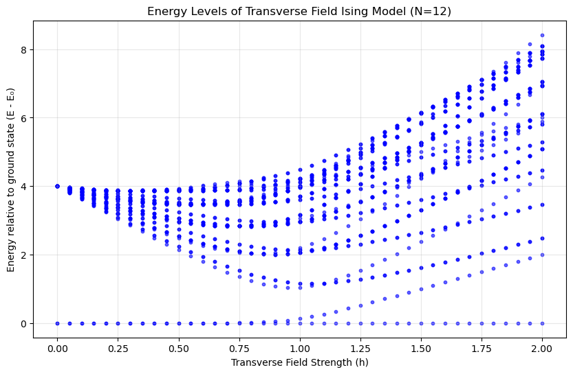
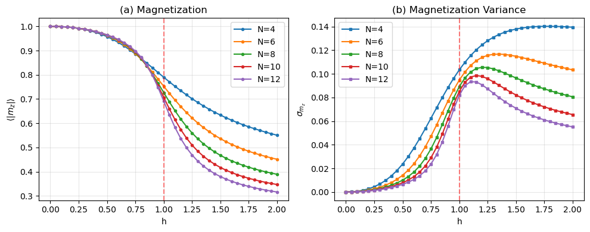
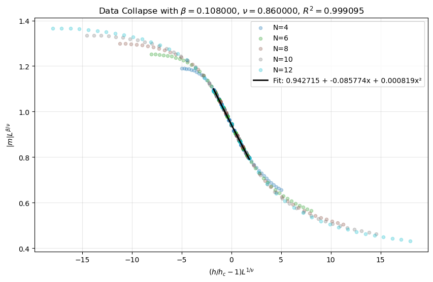

# 横场Ising模型的精确对角化与物理性质验证 🌐[English Version](README_English.md)

本项目通过精确对角化方法，数值求解一维横场Ising模型，计算不同系统尺寸下的能谱、基态磁化强度及其方差，并通过有限尺寸标度分析获得量子相变的临界指数，
与理论普适类进行对比。

---

## 物理背景

一维横场Ising模型的哈密顿量为

$$
H = -J \sum_{i=1}^N \sigma_i^z \sigma_{i+1}^z - h \sum_{i=1}^N \sigma_i^x
$$

其中 $J$ 为近邻自旋交换相互作用强度（取 $J=1$ ）， $h$ 为横向磁场强度， $\sigma_i^{z,x}$ 为 Pauli 矩阵。模型在 $h = 1$ 处经历从铁磁相到顺磁相的连续量子相变，
属于二维经典 Ising 模型普适类，其临界指数为 $\beta = 1/8$ 和 $\nu = 1$ 。

本代码解决的核心问题：  
1. 利用自旋构型的二进制表示，构造任意系统尺寸 $N$ 的哈密顿量矩阵，通过精确对角化获得本征值和本征矢，绘制能谱随横向场 $h$ 的变化。  
2. 计算不同 $N$ 下的基态平均绝对磁化强度 $\langle|m_z|\rangle$ 及其方差 $\sigma_{m_z}$ ，观察 $h=1$ 附近的量子相变特征及有限尺寸效应。  
3. 对磁化强度数据做标度变换，实现数据塌缩，并通过高精度网格搜索拟合标度函数，寻找最优临界指数 $\beta$ 和 $\nu$ ，与 Ising 普适类的理论值比较。

---

## 数值方法

### 1. 精确对角化求解能谱



- **自旋构型表示**：将 $N$ 个自旋的 $2^N$ 种构型用 $N$ 位二进制数表示，其中 $0$ 对应自旋向下， $1$ 对应自旋向上。
- **哈密顿量构建**：
  - 对角元：计算各构型下 $-J \sum\sigma_i^z \sigma_{i+1}^z$ 的贡献，采用周期性边界条件。
  - 非对角元：横向场项 $-h \sum \sigma_i^x$ 翻转单个自旋，在对应的两个状态之间添加矩阵元 $-h$ 。
- **对角化**：使用 `numpy.linalg.eigvalsh` 计算厄米矩阵的本征值，取最低若干能级（默认 50 个）。
- **参数扫描**：横向场 $h$ 在 $[0, 2.0]$ 范围内以步长 $0.05$ 变化，记录每个 $h$ 下的能谱。

### 2. 磁化强度与方差计算



- **基态波函数**：对每个 $h$ 值，利用 `numpy.linalg.eigh` 同时获得本征值和本征矢，选取基态（最低能量本征态）。
- **磁化强度期望值**：
  
$$
\langle|m_z|\rangle = \sum_{\text{states}} |c_i|^2 \cdot \frac{|N_{\uparrow} - N_{\downarrow}|}{N}
$$
  
  其中 $|c_i|^2$ 为基态在各构型上的概率， $N_{\uparrow}, N_{\downarrow}$ 为该构型的自旋向上、向下数目。
- **磁化强度方差**：

$$
\sigma_{m_z}^2 = \langle m_z^2 \rangle - \langle|m_z|\rangle^2
$$

- **系统尺寸**：分别计算 $N = 4, 6, 8, 10, 12$ 的情况。

### 3. 有限尺寸标度与数据塌缩



- **标度假设**：在临界点附近，磁化强度满足标度关系

$$
|m(h, L)| = L^{-\beta/\nu}  \mathcal{M}\left( (h/h_c - 1) L^{1/\nu} \right)
$$

  其中 $L$ 为系统尺寸（ $L=N$ ）， $h_c=1$ 为临界场， $\mathcal{M}$ 为普适标度函数。
- **数据塌缩**：定义标度变量

$$
X = (h/h_c - 1) L^{1/\nu}, \quad Y = |m| L^{\beta/\nu}
$$

  若参数 $\beta,\nu$ 合适，不同 $L$ 的数据在 $(X,Y)$ 平面上将塌缩到同一条曲线。
- **高精度网格搜索**：
  - 在 $\beta \in [0.08, 0.18]$ 、 $\nu \in [0.8, 1.2]$ 范围内生成 $101\times101$ 的网格。
  - 对每组 $(\beta,\nu)$ ，计算塌缩后的 $X, Y$ ，选取 $|X|<2$ （临界区域）的数据，把 $\mathcal{M}$ 展开为二次多项式 $Y = C_0 + C_1 X + C_2 X^2$ 并拟合，计算决定系数 $R^2$ 。
  - 以最大 $R^2$ 所对应的 $(\beta,\nu)$ 作为最优临界指数。

---

## 代码结构

- `Ising_ED.ipynb`：主要的 Jupyter Notebook，包含三部分：
  - **第一部分**：能谱计算。
    -  `build_hamiltonian(N, h, J=1.0)` 构造哈密顿量，
    -  `cal_energy_level(N, h_values, num_states=50)` 计算能级，
    -  `plot_energy_levels(...)` 绘制能谱图。
  - **第二部分**：磁化强度与方差计算。
    - `cal_mag(N, state_bin)` 计算单个状态的磁化强度，
    - `cal_mag_data(N_list, h_values)` 计算所有系统尺寸的磁化和方差，
    - `plot_mag_and_var(...)` 绘制结果图。
  - **第三部分**：数据塌缩与最优参数搜索。
    - `grid_search_optimal_params_high_precision(mag_data, h_values, h_c=1.0)` 执行高精度网格搜索
    - `plot_all_data_with_fit(...)` 绘制塌缩后的数据点及拟合曲线。

---

## 依赖环境

运行代码需要以下 Python 库：

- `numpy`
- `matplotlib`

建议使用 Python 3.7 及以上版本。

---

## 快速开始
  1. **克隆仓库**（或下载文件）：
     ```bash
     git clone https://github.com/chaoranyang/QuantumManyBody_FromZreo.git
     cd QuantumManyBody_FromZreo/Ising_ED
  2. **安装依赖**：
     ```bash
     pip install numpy matplotlib

## 结果输出

- **能谱图**：展示 $N=12$ 时最低 50 个能级（相对于基态能量）随横向场 $h$ 的变化。
- **磁化强度与方差图**：左图为不同 $N$ 下的磁化 ，右图为对应的方差，均在 $h=1$ 附近观察到相变特征与有限尺寸效应。
- **数据塌缩图**：使用最优 $\beta,\nu$ 将不同尺寸的磁化强度数据变换到同一标度曲线，同时展示二次拟合结果与 $R^2$ 值。
- **参数搜索结果**：输出最优 $\beta$、 $\nu$ 及拟合系数 $C_0, C_1, C_2$ ，并与理论值（ $\beta=0.125$ , $\nu=1.000$ ）比较相对误差。
